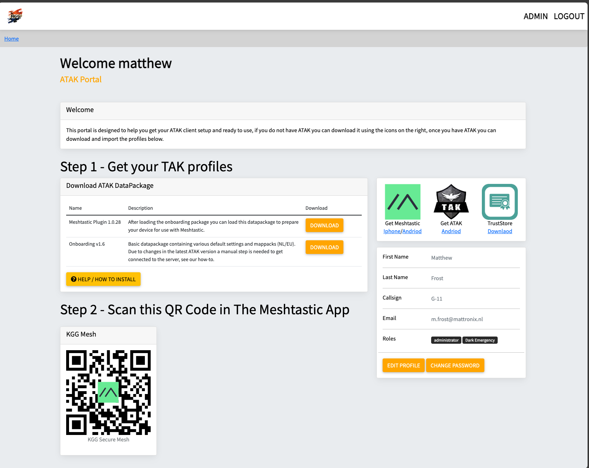
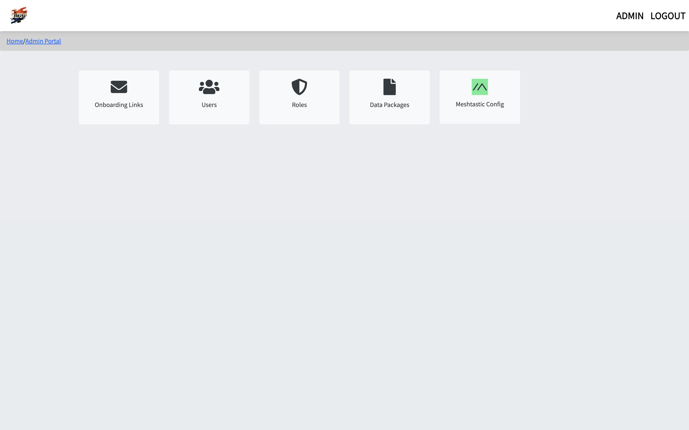
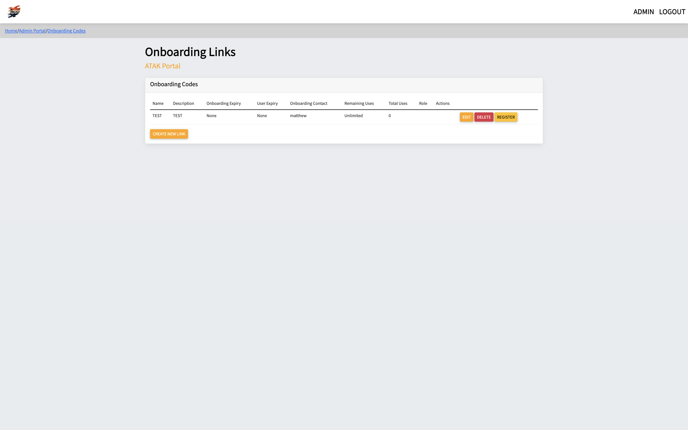
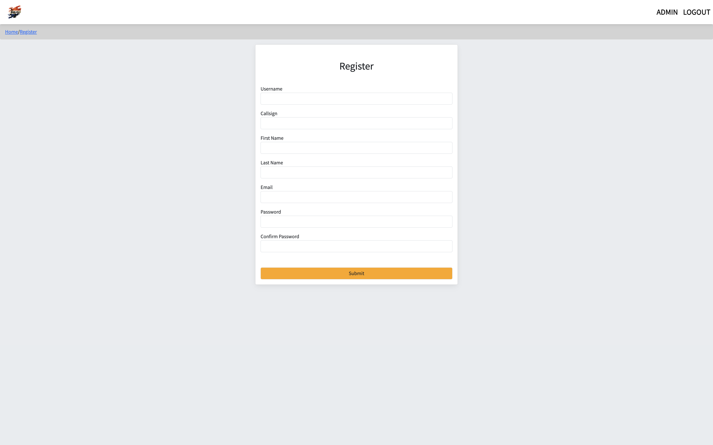

# OpenTAK Onboarding Portal

An open-source ATAK Portal that integrates with OpenTAK Server to provide a self-service onboarding experience for end users.

## Features

- Temporary access and automatic cleanup of temporary accounts
- Registration via secure links with max uses and email notifications
- Meshtastic QR Code display and radio configuration
- Data package automatic configuration of callsign
- Role-Based Access Control for data packages and Meshtastic configs
- Email notifications for new registrations
- Link expiry and user expiry
- Forgot password with email reset
- TAK Update Server Generator/Manager
- Uses OpenTAK Server for authentication
- Admins in OpenTAK are admins in the Portal
- Modern RESTful API + React SPA frontend
- 47 API endpoints with Swagger documentation

## Installation

Choose your preferred installation method:

| Method | Description | Guide |
|--------|-------------|-------|
| **Native (Ubuntu)** | Direct installation without Docker | [INSTALLER_NATIVE.md](./docs/INSTALLER_NATIVE.md) |
| **Docker (Automatic)** | One-line installer with Docker | [INSTALLER_AUTOMATIC.md](./docs/INSTALLER_AUTOMATIC.md) |
| **Docker (Manual)** | Manual Docker Compose setup | [DOCKER.md](./docs/DOCKER.md) |

### Quick Install (Ubuntu Native - No Docker)

```bash
apt-get install sudo curl -y
curl -s https://raw.githubusercontent.com/mattronix/opentak-onboarding-portal/refs/heads/main/scripts/installers/ubuntu-native-installer.sh | sudo bash
```

### Quick Install (Docker)

```bash
apt-get install sudo curl -y
curl -s https://raw.githubusercontent.com/mattronix/opentak-onboarding-portal/refs/heads/main/scripts/installers/ubuntu-installer.sh | sudo bash
```

## Documentation

All documentation is in the [`/docs`](./docs/) folder:

### Installation & Setup
- [Native Installation (Ubuntu)](./docs/INSTALLER_NATIVE.md) - Install directly without Docker
- [Automatic Docker Installer](./docs/INSTALLER_AUTOMATIC.md) - One-line Docker installation
- [Docker Setup](./docs/DOCKER.md) - Manual Docker Compose setup

### Configuration
- [Settings Guide](./docs/SETTINGS.md) - Environment variables and configuration options
- [Nginx Proxy](./docs/NGINX_PROXY.md) - Reverse proxy configuration

### API
- [API Reference](./docs/README_API.md) - RESTful API documentation

## Configuration

After installation, edit the `.env` file with your settings:

```bash
# Required
SECRET_KEY=your-secret-key
JWT_SECRET_KEY=your-jwt-secret
OTS_URL=https://your-tak-server-url
OTS_USERNAME=admin-username
OTS_PASSWORD=admin-password

# Optional - Branding
BRAND_NAME="My TAK Portal"
PRIMARY_COLOR="#000000"
ACCENT_COLOR="#ff9800"

# Optional - Features
MAIL_ENABLED=False
```

See [Settings Guide](./docs/SETTINGS.md) for all configuration options.

## Architecture

The portal supports two interfaces simultaneously:

### Traditional Forms UI
- Server-side rendering with Jinja2
- Form-based requests
- Session-based authentication

### Modern API + SPA
- RESTful API backend (47 endpoints)
- React Single Page Application
- JWT token authentication
- Swagger UI documentation at `/api/docs`

Both interfaces share the same database and OpenTAK Server integration.

## API

- **Base URL**: `/api/v1/`
- **Documentation**: `/api/docs` (Swagger UI)

### Endpoints

| Module | Endpoints | Description |
|--------|-----------|-------------|
| Authentication | 8 | Login, register, password management |
| Users | 5 | User CRUD operations |
| Roles | 5 | Role management |
| Onboarding Codes | 6 | Registration code management |
| TAK Profiles | 6 | Profile management + downloads |
| Meshtastic | 5 | Radio configuration |
| Radios | 7 | Device inventory |
| Packages | 5 | ATAK package management |
| Settings | 1 | Public configuration |

### Authentication Example

```bash
# Login
curl -X POST http://localhost:5000/api/v1/auth/login \
  -H "Content-Type: application/json" \
  -d '{"username":"admin","password":"password"}'

# Use token
curl http://localhost:5000/api/v1/users \
  -H "Authorization: Bearer <token>"
```

## Development

### Backend

```bash
# Install dependencies
pip install -r requirements.txt

# Run development server
flask run --debug

# Run database migrations
flask db upgrade

# Create new migration
flask db migrate -m "Description"
```

### Frontend

```bash
cd frontend

# Install dependencies
npm install

# Development server (hot reload)
npm run dev

# Production build
npm run build
```

### Testing

```bash
# Run tests
pytest

# Run with coverage
pytest --cov=app --cov-report=html
```

## Screenshots

### Homepage


### Admin Menu


### Onboarding Codes


### User Registration


## Tech Stack

**Backend:**
- Flask 2.2.4
- Flask-JWT-Extended
- Flask-CORS
- Flasgger (Swagger)
- SQLAlchemy
- Gunicorn

**Frontend:**
- React 18
- Vite
- React Router
- Axios
- TanStack Query

## Support

- **Issues**: [GitHub Issues](https://github.com/mattronix/opentak-onboarding-portal/issues)
- **API Docs**: http://localhost:5000/api/docs
- **Documentation**: [`/docs`](./docs/) folder

## License

Open Source
