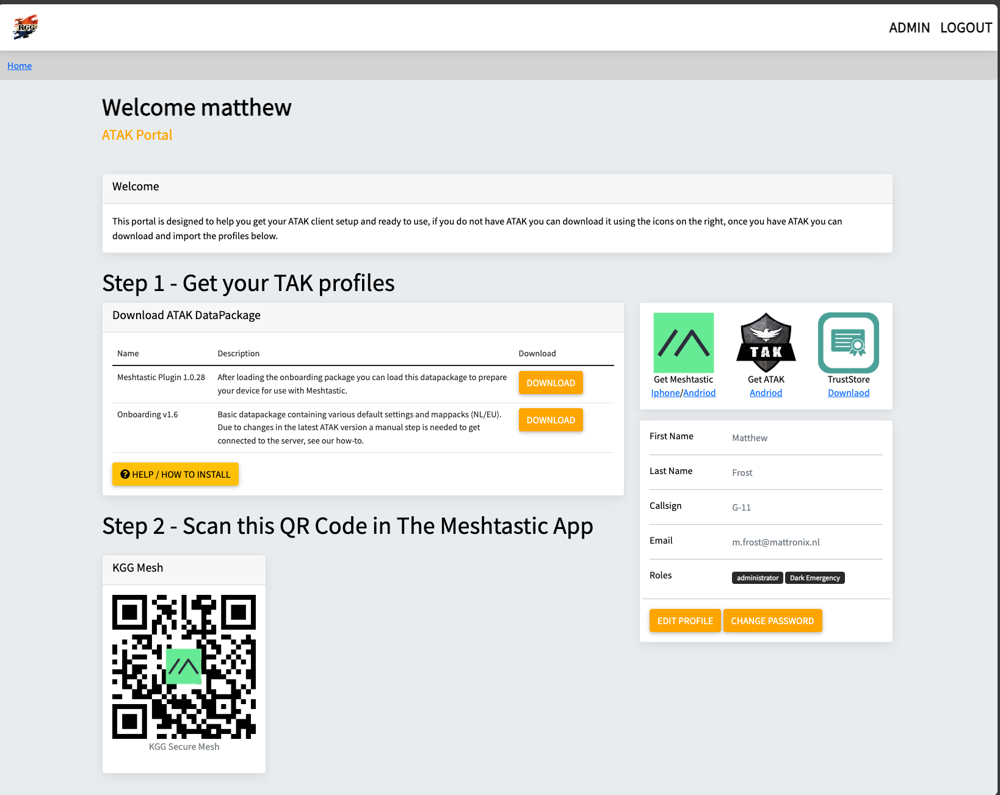
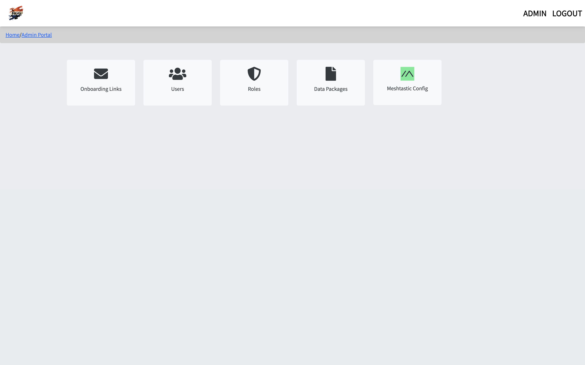
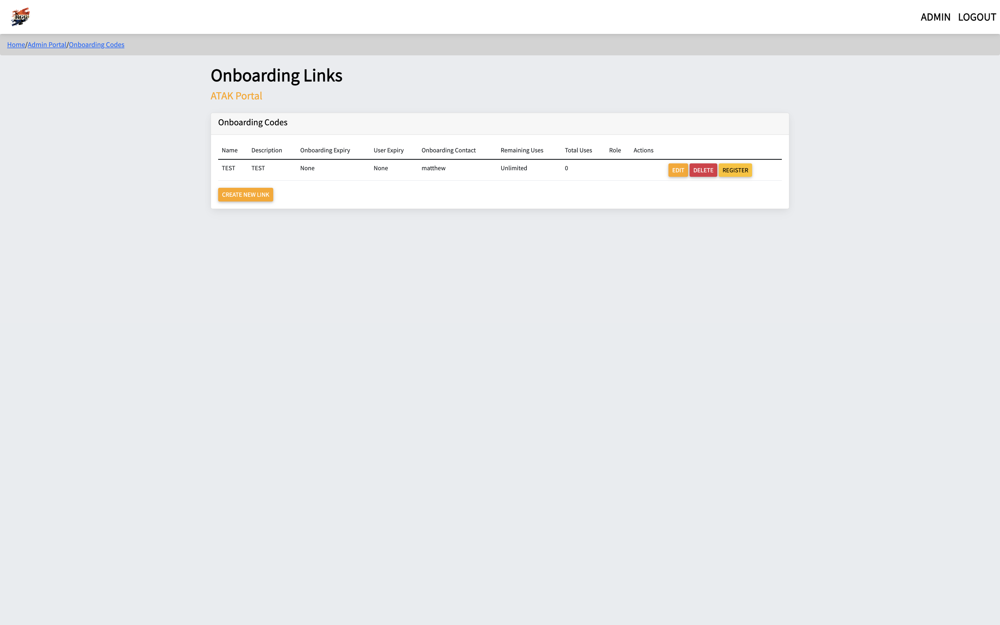
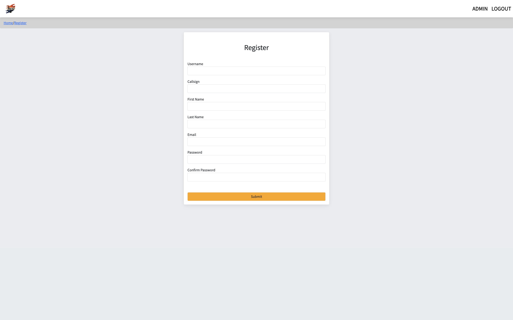

Flask Onboarding Portal for OpenTAK
# What is this project?

This project is an Opensource ATAK Portal that works with OpenTak Server to provide a self service onboarding experiance for end users.

# Features 
* Temporary access and cleanup of temporary accounts
* Registration by secure link withn max uses and email notification to link owner 
* Meshtastic QR Code Display
* Data package automatic Config of call sign
* Role Based Access Control to Datapackages and Meshtastic Configs
* Email Notifications for New Registrations
* Max Link Usage
* Link Expiry
* User Expiry
* Forgot Password and E-Mail Reset (bit basic still as it uses a token that is time invalidated FIXED Soon)
* Data Package Structure Viewer (really basic)
* Uses OPENTAK Server for authentication
* Admins in Opentak are Admin's in Portal
* TAK Update Server Generator/Manager

# Setup
git clone
copy env.dist to .env and replace with real info. 
```
cp env.dist .env
cp docker-compose.yml.dist docker-compose.yml
# If you want to expose a tak update server via OTS and this container runs on the same host as OTS uncomment the volume line in docker-compose.yml 
docker compose build
docker compose up -d
docker compose exec web flask db upgrade
```

# upgrade
```
git pull
docker compose build
docker compose up -d
docker compose exec web flask db upgrade
```

# Update Server Info

If you want to expose a tak update server via OTS and this container runs on the same host as OTS uncomment the volume line in docker-compose.yml 

Otherwise by default its exposed on /updates but for ATAK clients to work you will need to add the webserver certificate in a trust-store and add it to the "update trust store" of the ATAK device.

WARNING: You will want to add a volume bind mount to ensure the data is not lost when the container restarts this can be done by adding a volume to the docker-compose.yml 
Example Volume Mount: 

```
version: '2'
services:
    web:
        volumes:
          - ./:/app
           #  Used to export updates to the host
          - ./update:/app/updates
```

# DEV 

## Creating Migrations
```
flask db migrate -m "Migration Description."
```
## Executing Migrations
```
flask db upgrade
```

## Development Environment
To run this project inside of docker just type:
```
flask run --debug

# Debug Flag will enable auto refresh
```


# Screenshots

Here are some screenshots of the project:

## Homepage

## Admin Menu

## Onboarding Listing Page

## User Registration



